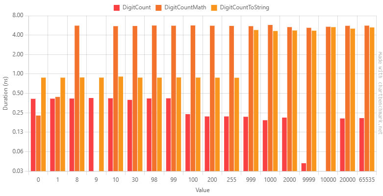
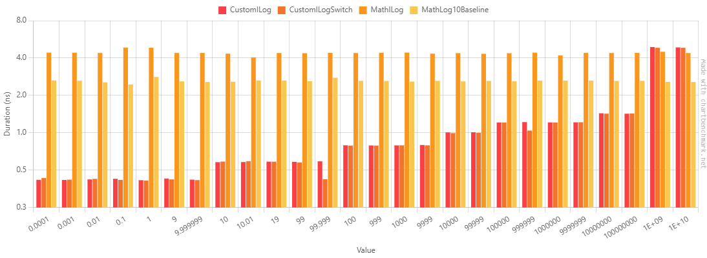

# Strings, Exponents & Log10 (Short ver.)

[Longer version](https://github.com/Rekkonnect/Log10Article/blob/master/docs/article.md)

By Alex "Rekkon", on 2025-05-03

## Disclaimer

This article was written in an attempt to raise awareness and explore the world of calculations related to processing numbers in base 10. It is not any piece of formal or meticulous research, and each point must be taken with a grain of salt as with everything anywhere.

All the code examples below are in C#, and is run in .NET. Despite showing opinionated examples, the key takeaway is not bound to a specific language, framework, runtime and their corresponding tricks for juicing out faster JIT assemblies. I only chose this set of tools for familiarity reasons. All numeric functions that were written in this article should be trivially translatable to other languages, including C, C++, Java, Python, Rust, Go, Scala, Kotlin, Brainfuck, Moo, Shakespeare, you name it.

The associated benchmarks were run with Benchmark.NET, which is pretty mature and insightful, suitable for both macro- and microbenchmarks. Be sure to check it out if you're interested in how it executes benchmarks and what features it offers.

The configuration for all the benchmarks is:
```
BenchmarkDotNet v0.14.0, Windows 10 (10.0.19045.5737/22H2/2022Update)
AMD Ryzen 9 5950X, 1 CPU, 32 logical and 16 physical cores
.NET SDK 9.0.300-preview.0.25177.5
  [Host]     : .NET 9.0.4 (9.0.425.16305), X64 RyuJIT AVX2 [AttachedDebugger]
  Job-HPLCQC : .NET 9.0.4 (9.0.425.16305), X64 RyuJIT AVX2
```
The iteration time is usually set to 150ms to shorten the time the benchmarks take to execute (B.NET defaults to 500ms). If the benchmark code is present, it may include the iteration time that the benchmark is set to, in milliseconds.

This article contains images with benchmark results, which were generated using https://chartbenchmark.net/, including extensive tables with the raw results, initially collapsed. The graphs only display the mean execution time due to the tool's customization limitations. Notice that the y axis is in log2 scale.

This file is a shorter version of the [original article](https://github.com/Rekkonnect/Log10Article/blob/master/docs/article.md), which does not include the extensive benchmark tables and removes some linked code snippets. Consult either the original untrimmed article or the linked snippets and the [repository](https://github.com/Rekkonnect/Log10Article/) for further information.

## Debrief

A log-standing problem in computer science is calculating the number of digits a number has. In undergrads, you will usually find solutions like "keep dividing until the result is 0" or "if the number is > 10^k, the count is k + 1". Unfortunately, even [bad solutions](https://www.geeksforgeeks.org/program-count-digits-integer-3-different-methods/)  are being blatantly posted without any regards to performance or best practices for the specific ecosystem (language, STL, etc.). Most experienced devs settle with a logarithm of base 10 to deal with the problem without worrying about re-inventing the wheel, so it's important that you can rely on its accuracy for all inputs and its speed. Hardware implementations that are used in the process of calculating a base-10 logarithm include instructions for calculating intermediate results to the finest precision, as IEEE-754 demands.

However there is also the integral log10, which returns just the integer part of the logarithm's result. When creating a string representation of a number, that's all we care about. All the fractional parts of the logarithm's result are useless and unnecessary. We need specific specialized instructions for calculating the integral log10 of a number, whether it be a 32- or 64-bit floating-point, or an integer of 8, 16, 32 or 64 bits.

Following https://en.wikipedia.org/wiki/X86_instruction_listings, we can find the following instructions available in x87: `FYL2X` and `FYL2XP1`. The only problem is that they are described as base-2 logarithms. Obviously, they can be used when calculating any logarithm in any base, applying the required transformations between each logarithmic base. But it's all software-driven, including log10. We lack actually designed instructions for the most basic task an application does multiple times throughout its lifetime; converting a number to a base-10 string representation.

> NOTE: ARM does not even have any logarithmic functions. But this is something that won't be touched on because it's a more specialized instruction set meant to be used in lower-end machines, where the cost of implementing any more logic into the circuit would cause unnecessary penalties in the rest of the system, and thus a software implementation of any transcendental function is more appropriate.

I'm not much of a hardware guy, my whole life has been software pretty much. But I do know that logarithms are expensive. And there are two problems with using logarithms for base-10 digit count:
- Logarithms are not even necessary. We throw away the entire carefully-calculated fractional part of the result. Any cheaper implementation of the logarithm would still over-suffice.
- Hardware instructions for log10 itself do not exist in x86 or ARM, the most commonly-used instruction sets in most popular commercially-available devices (FPGAs and supercomputer-specialized components are not generally available and this article won't explore that area).
So to solve this, we need hardware instructions that make base-10 digit count easier to calculate, preferably just one hardware instruction for each data type (32/64-bit floats, 8/16/32/64-bit unsigned integers).

But this solution doesn't make me sleep at nights. I'm a software developer, I don't have the hardware implementation, might as well roll my own software implementation until that day. And so I did.

## Software Rescue

We need to develop a base-10 digit count function for all of the 6 data types described above: 32/64-bit floats, 8/16/32/64-bit unsigned integers. We will start with the integers since they are the most basic ones.

### Integers

First let's analyze the limits of the data types:
- 8-bit ranges in `[0, 255]`, so it's got 1-3 decimal digits.
- 16-bit ranges in `[0, 65,535]`, so 1-5 digits.
- 32-bit ranges in `[0, 4,294,967,296]`, making it 1-10 digits.
- 64-bit ranges in `[0, 18,446,744,073,709,551,615]`, with 1-20 digits.

From the above we can tell that the 8/16-bit implementations have a tiny result set, and the 32/64-bit are still modest with a few extra values. We can leverage a trivial cheap solution for 8-bit as a PoC:
```csharp
public static int DigitCount(byte b)
{
    if (b >= 100)
        return 3;
        
    if (b >= 10)
        return 2;
        
    return 1;
}
```

This is a pretty self-explanatory solution. The only problem we have here are the potential branch mispredictions, which are very expensive and would completely defeat the purpose of all the optimizations we tried to implement.

For a first, we'll compare this implementation to others. Take for example two other common solutions to this problem:
```csharp
public static int DigitCountMath(byte b)
{
    if (b is 0)
    {
        return 1;
    }

    if (b is 1)
    {
        return 1;
    }

    return (int)Math.Ceiling(Math.Log10(b + 1));
}

public static int DigitCountToString(byte b)
{
    return b.ToString().Length;
}
```

In `DigitCountToString`, by calling `ToString` we are defeating the purpose of implementing a digit count for the purposes of a faster string conversion. Obviously this is only for baseline purposes.

It would make sense if we assumed the solution using `ToString` would be the slowest; allocating a new string, iterating the number's digits, much more involved than a "simple" ceiling and log over a byte converted to a double.

"What's a string allocation?", said the .NET runtime:


Our `DigitCount` is almost indistinguishable from a method invocation (literally what Benchmark.NET says):
> `ByteDigitCountBenchmarks.DigitCount: IterationTime=150ms -> The method duration is indistinguishable from the empty method duration`

But most importantly, why is `ToString` significantly faster than the math solution for the cases other than 0 and 1? Nobody would have seen that ceiling + log is so terrible, right?

One important note is that the .NET runtime has incorporated tons of optimizations having undergone strenuous benchmarking effort throughout the over two decades that it has been alive. So usually it should not come as a surprise that common methods like `ToString` would be blazingly fast and any homebrew solution would appear terrible compared against it.

When going to the `ToString` definition for `byte`, we see this:
```csharp
public override string ToString()
{
    return Number.UInt32ToDecStr(m_value);
}
```

Browsing the code for the .NET Runtime [on GitHub](https://github.com/dotnet/runtime/blob/main/src/libraries/System.Private.CoreLib/src/System/Number.Formatting.cs#L645) we find that this actually makes use of cached strings for small numbers. For non-Mono platforms, which most are nowadays, this includes cached strings for values \[0, 300), therefore clearing out the entire byte range. This is also great because we avoid unnecessary string allocations, at the cost of only `10 * 1 + 90 * 2 + 200 * 3` = 10 + 180 + 600 = 790 characters across 300 strings, summing to 1580 bytes for the characters themselves and 300 pointers to the instances, meaning 2400 bytes for pointers alone. Without diving too deep into specifics and nerd analysis, let's assume that a total of 10~15 KiB is used for small number cache. It's important to note that those small strings are lazily created on-demand, meaning the theoretical memory allocated for the cached strings is usually much less than 10~15 KiB; even more negligible especially for the performance value it provides.

With that out of the way, it's now time to test our technique for 16-bit integers. We use the same code as above, for the `ushort` type, except we add two more cases for our custom `DigitCount`:
```csharp
public static int DigitCount(ushort value)
{
    if (value >= 10000)
        return 5;

    if (value >= 1000)
        return 4;

    if (value >= 100)
        return 3;

    if (value >= 10)
        return 2;

    return 1;
}
```



> For some reason the execution of `DigitCountMath` with `Value = 9` yielded zeroes. The logs are attached in the original article.

For the above results, at Value = 999 onwards we're starting to see `ToString` take a huge perf penalty, which aligns with the use of a small number string cache. Still it's faster to construct a garbage-collectable string than to use ceil + log up until the max value of u16. In the best case, iterative divisions are faster, in the worst case there's also the overhead of a digit count calculation to pre-compute the string length. Indeed, this is the implementation we're interested in: [here](https://github.com/dotnet/runtime/blob/main/src/libraries/System.Private.CoreLib/src/System/Number.Formatting.cs#L1673):
```csharp
internal static string UInt32ToDecStr(uint value)
{
    // For small numbers, consult a lazily-populated cache.
    if (value < SmallNumberCacheLength)
    {
        return UInt32ToDecStrForKnownSmallNumber(value);
    }

    return UInt32ToDecStr_NoSmallNumberCheck(value);
}

internal static string UInt32ToDecStrForKnownSmallNumber(uint value)
{
    // omitted for brevity
}

private static unsafe string UInt32ToDecStr_NoSmallNumberCheck(uint value)
{
    int bufferLength = FormattingHelpers.CountDigits(value);

    string result = string.FastAllocateString(bufferLength);
    fixed (char* buffer = result)
    {
        char* p = buffer + bufferLength;
        p = UInt32ToDecChars(p, value);
        Debug.Assert(p == buffer);
    }
    return result;
}
```

The implementation does pre-calculate the digit count, so it's definitely fast. Let's see what they've done (source [here](https://github.com/dotnet/runtime/blob/main/src/libraries/System.Private.CoreLib/src/System/Buffers/Text/FormattingHelpers.CountDigits.cs#L65)):

```csharp
[MethodImpl(MethodImplOptions.AggressiveInlining)]
public static int CountDigits(uint value)
{
    // Algorithm based on https://lemire.me/blog/2021/06/03/computing-the-number-of-digits-of-an-integer-even-faster.
    ReadOnlySpan<long> table =
    [
        4294967296,
        8589934582,
        8589934582,
        8589934582,
        12884901788,
        12884901788,
        12884901788,
        // ... omitted values
    ];
    Debug.Assert(table.Length == 32, "Every result of uint.Log2(value) needs a long entry in the table.");

    // TODO: Replace with table[uint.Log2(value)] once https://github.com/dotnet/runtime/issues/79257 is fixed
    long tableValue = Unsafe.Add(ref MemoryMarshal.GetReference(table), uint.Log2(value));
    return (int)((value + tableValue) >> 32);
}
```

Now we have a good idea as to how the digit count is calculated. But I fear that using log 2 is still not the best solution, so it's best to benchmark this. Unfortunately the `CountDigit` method is inside an internal class named `FormattingHelpers`. We will have to copy this implementation in our own code to properly test it.

To compare apples to apples, we will now move towards the 32-bit integers.


Somewhat surprisingly and somewhat unsurprisingly, our solution is much worse than the STL version. And it passes all tests when comparing against any solution, slower or not. The key is that `uint.Log2`  uses `BitOperations.Log2` which is a simple leading zero count (`LZCNT`) calculation and a subtraction from the bit count of the data type. Specifically also supported on various architectures as seen [in the source](https://github.com/dotnet/runtime/blob/main/src/libraries/System.Private.CoreLib/src/System/Numerics/BitOperations.cs#L277).

Like I said before,
> One important note is that the .NET runtime has incorporated tons of optimizations having undergone strenuous benchmarking effort throughout the over two decades that it has been alive. So usually it should not come as a surprise that common methods \[...\] would be blazingly fast and any homebrew solution would appear terrible compared against it.

I didn't even test the branch misprediction theory, but it should be self-evident that it plays a role. This could be partly mitigated by using a binary search structure in the code, but even then we still leave room for branch mispredictions, and we perform many comparisons, which means more instructions compared to the very simple `OR`, `XOR` and `LZCNT` solution of `Log2` and the lookup table that contains magic numbers to guarantee correctness for every single value.

There is one trick however we can apply to eliminate branch mispredictions. Instead of selectively performing the comparisons, we just perform them all. Only one will be true at a time, so we can OR the result of each comparison individually, something that modern CPUs will happily parallelize despite the long instruction list.

This is the code, tested of course against the baseline implementations for correctness:
```csharp
public static int DigitCountCompareAll(uint value)
{
    uint mask = (UIntBool(value >= 0 && value < 10) << 1)
        | (UIntBool(value >= 10 && value < 100) << 2)
        | (UIntBool(value >= 100 && value < 1000) << 3)
        | (UIntBool(value >= 1000 && value < 10000) << 4)
        | (UIntBool(value >= 10000 && value < 100000) << 5)
        | (UIntBool(value >= 100000 && value < 1000000) << 6)
        | (UIntBool(value >= 1000000 && value < 10000000) << 7)
        | (UIntBool(value >= 10000000 && value < 100000000) << 8)
        | (UIntBool(value >= 100000000 && value < 1000000000) << 9)
        | (UIntBool(value >= 1000000000) << 10)
        ;
    return (int)uint.Log2(mask);
}

[MethodImpl(MethodImplOptions.AggressiveInlining)]
private static uint UIntBool(bool x)
{
    return x ? 1U : 0U;
}
```


The compare all solution is always too much slower than the STL one. However this may be attributed to having used `&&`, which conditionally avoids executing the right hand side of the operand if the left one is `false`. Replacing this shorthand with the bitwise operator `&` we have this code:
```csharp
public static int DigitCountCompareAllBitwise(uint value)
{
    uint mask = ((UIntBool(value >= 0) & UIntBool(value < 10)) << 1)
        | ((UIntBool(value >= 10) & UIntBool(value < 100)) << 2)
        | ((UIntBool(value >= 100) & UIntBool(value < 1000)) << 3)
        | ((UIntBool(value >= 1000) & UIntBool(value < 10000)) << 4)
        | ((UIntBool(value >= 10000) & UIntBool(value < 100000)) << 5)
        | ((UIntBool(value >= 100000) & UIntBool(value < 1000000)) << 6)
        | ((UIntBool(value >= 1000000) & UIntBool(value < 10000000)) << 7)
        | ((UIntBool(value >= 10000000) & UIntBool(value < 100000000)) << 8)
        | ((UIntBool(value >= 100000000) & UIntBool(value < 1000000000)) << 9)
        | (UIntBool(value >= 1000000000) << 10)
        ;
    return (int)uint.Log2(mask);
}
```


It's just slower. The code gen appears "normal":
```asm
C.DigitCountCompareAllBitwise(UInt32)
    L0000: push ebp
    L0001: mov ebp, esp
    L0003: push ebx
    L0004: cmp ecx, 0xa
    L0007: setae al
    L000a: movzx eax, al
    L000d: cmp ecx, 0x64
    L0010: setb dl
    L0013: movzx edx, dl
    
    ; [... truncated]
    
    L0104: setae dl
    L0107: movzx edx, dl
    L010a: shl edx, 0xa
    L010d: or eax, edx
    L010f: or eax, 1
    L0112: lzcnt eax, eax
    L0116: xor eax, 0x1f
    L0119: pop ebx
    L011a: pop ebp
    L011b: ret
```

The problem is this is a massive function. And while this would be much better in the circuit, writing it in software only makes it unbearably slower. Despite the UIntBool function being inlined, and despite avoiding branch mispredictions, this solution is destined to be slower.

Moving on to the 64-bit version of the algorithm, we'll only compare the original if-based DigitCount implementation against [.NET's STL implementation](https://github.com/dotnet/runtime/blob/main/src/libraries/System.Private.CoreLib/src/System/Buffers/Text/FormattingHelpers.CountDigits.cs#L15). For brevity, we will omit some magnitudes due to the large value range of 64-bit integers.

To avoid getting our custom implementation too lengthy, that we will simply check if the number is over 10 digits long and get the upper digits' decimal length, looking like this:
```csharp
public static int DigitCount(ulong value)
{
    const ulong largeThreshold = 10_000_000_000;
    
    if (value >= largeThreshold)
    {
        ulong remaining = value / largeThreshold;
        return DigitCount(remaining) + 10;
    }

    if (value >= 1000000000)
        return 10;

    if (value >= 100000000)
        return 9;

    if (value >= 10000000)
        return 8;

    if (value >= 1000000)
        return 7;

    if (value >= 100000)
        return 6;

    if (value >= 10000)
        return 5;

    if (value >= 1000)
        return 4;

    if (value >= 100)
        return 3;

    if (value >= 10)
        return 2;

    return 1;
}
```

The results came back:


It's undeniable that the STL knows what it's doing. Once again the custom implementation ate dirt and it's clear that we should step out of the way of integers. With execution times as short as ~0.23 ns (basically in-cycle execution), the STL solution is the best (so far) software solution to use. Therefore the only problem is that we do not have access to this method without browsing the source directly. This is a very low-cost and 100% correct set of methods to calculate the digit count of a number.

And we have not even tested against branch mispredictions yet. This is assuming the happy path is always followed after every execution; the CPU will keep expecting the same execution path until the `Value` changes, where its prediction will fail, maybe a few times until it decides on another execution path to predict for the rest of the benchmark on the same `Value`.

To test for branch misprediction impact, we will construct a scenario where there's many differently-sized integers being processed, to throw off the branch predictor enough that it will hesitate which path it should definitely take. Here is the benchmark:

```csharp
[IterationTime(250)]
public class UInt64RandomDigitCountBenchmarks
{
    [Benchmark]
    public int DigitCount()
    {
        return DigitCountSum(Log10.DigitCount);
    }

    [Benchmark(Baseline = true)]
    public int DigitCountStl()
    {
        return DigitCountSum(Log10.DigitCountStl);
    }

    private static int DigitCountSum(Func<ulong, int> digitCounter)
    {
        int sum = 0;

        for (int i = 0; i < 4; i++)
        {
            sum += digitCounter(1);
            sum += digitCounter(2);
            sum += digitCounter(100321);
            sum += digitCounter(38);
            sum += digitCounter(13290);
            sum += digitCounter(3128791238719);
            sum += digitCounter(ulong.MaxValue);
            sum += digitCounter(9401);
            sum += digitCounter(100000000);
            sum += digitCounter(10341245214532535663);
            sum += digitCounter(132904351211);
            sum += digitCounter(5429138726719879);
            sum += digitCounter(103);
            sum += digitCounter(5429138726719812379);
            sum += digitCounter(0);
            sum += digitCounter(ulong.MaxValue);
        }

        return sum;
    }
}
```

We do not care about the absolute results here, but the relative impact of branch mispredictions. While there is some overhead attached to this process, we can only extrapolate that the performance impact will be worse than what is displayed in the run results. Therefore, using delegates (almost equivalent to function pointers) is acceptable here, and so is looping this scenario 4 times and adding the results to a sum. This summation was added to achieve two things:
- guarantee that the digit count functions are executed serially, without branching off independently to one-another, by depending the state of `sum` to the result of each individual execution
- avoid Benchmark.NET or the .NET JIT itself trimming out the unused results of the invocations
That summation is not an unlikely scenario though; if we wanted to concatenate all those numbers into a string, we would be continually increasing the concatenated string's total length to the digit count of each of those numbers, and potentially other content in-between.

| Method        | Mean     | Error   | StdDev  | Ratio | RatioSD |
|-------------- |---------:|--------:|--------:|------:|--------:|
| DigitCount    | 165.4 ns | 1.63 ns | 1.52 ns |  1.65 |    0.02 |
| DigitCountStl | 100.4 ns | 0.98 ns | 0.86 ns |  1.00 |    0.01 |

The result here shows that our implementation is 65% worse than the STL one. Based on the previous benchmarks with the fixed `Value` parameter, we had an average of ~180% worse performance than the STL solution. This improved performance ratio is thanks to the aforementioned overhead of adding and looping, where we have eliminated the isolation of each function's execution.

It is though evident that even in a simple simulation of pre-calculating the buffer length of the concatenation of multiple numbers such as the ones above, the STL solution is much better than this homebrewed digit count solution.

**EDIT 2025-05-04**: While the intent was to write a benchmark that forces serial execution of the method, the benchmark above failed at that. While the result of the sum variable depended on previous executions, the executions' results didn't. So it was probably easily speculatively executable for the CPU. All we need to change is adding the `sum` value to the value whose digits are being counted:

```csharp
private static ulong DigitCountSumInterdependent(Func<ulong, int> digitCounter)
{
    ulong sum = 0;

    for (int i = 0; i < 4; i++)
    {
        sum += (uint)digitCounter(sum + 1);
        sum += (uint)digitCounter(sum + 2);
        sum += (uint)digitCounter(sum + 100321);
        sum += (uint)digitCounter(sum + 38);
        sum += (uint)digitCounter(sum + 13290);
        sum += (uint)digitCounter(sum + 3128791238719);
        sum += (uint)digitCounter(sum + ulong.MaxValue);
        sum += (uint)digitCounter(sum + 9401);
        sum += (uint)digitCounter(sum + 100000000);
        sum += (uint)digitCounter(sum + 10341245214532535663);
        sum += (uint)digitCounter(sum + 132904351211);
        sum += (uint)digitCounter(sum + 5429138726719879);
        sum += (uint)digitCounter(sum + 103);
        sum += (uint)digitCounter(sum + 5429138726719812379);
        sum += (uint)digitCounter(sum + 0);
        sum += (uint)digitCounter(sum + ulong.MaxValue);
    }

    return sum;
}
```

And voilà:

| Method                       | Mean      | Error    | StdDev   | Ratio | RatioSD |
|----------------------------- |----------:|---------:|---------:|------:|--------:|
| DigitCountStl                |  99.83 ns | 0.778 ns | 0.727 ns |  1.00 |    0.01 |
| DigitCount                   | 162.34 ns | 0.813 ns | 0.720 ns |  1.63 |    0.01 |
| DigitCountStl_Interdependent | 231.81 ns | 0.816 ns | 0.763 ns |  2.32 |    0.02 |
| DigitCount_Interdependent    | 156.65 ns | 0.752 ns | 0.704 ns |  1.57 |    0.01 |

Truly interdependent execution of the STL implementation is much slower than even our homebrew digit count. Ironically, our solution is consistently slightly faster when adding the `sum` value to the number, which is probably because we're moving upwards in the if-statement chain by passing in larger values. This is only specific to this benchmark, and since this difference in measure can be explained, it does not prove anything about the method execution time being affected by making the input dependable on the previous execution.

And that concludes the story for integers. Let's move on to floating-point numbers.

### Floating-point

One good reason why this research even began is because I need to represent floating-point numbers supporting massive exponents, rolling a custom scientific notation data type. This type will use a 64-bit floating-point for the mantissa and a 64-bit integer for the exponent. While not the most efficient memory-wise, it supports "a good chunk" of the number range I need to cover[^1].

[^1]:In reality, I want to support a much more complex data structure representing power towers and exponential notation. This data type was simplified for the purposes of this article. The real type will use a f64 mantissa, u32 exponent and u32 power tower height, resulting in a very machine-friendly 16-byte struct. More on that in another article.

Since we intend to store the exponent in the u64 field of our data type, we want to keep the number in a normalized form. Let's define the data type to represent numbers in the form M x 10\^E, where M is the f64 mantissa in the range \[1, 10\), and E is the exponent in the range \[0, 2\^64\).

> In this theoretical type, let's assume that if E = 0, we will allow the mantissa to be in \[0, 1\) to support smaller values, but we won't represent too small values with E accepting negative values. This detail will not matter moving forward in the article.

When performing operations with such numbers, almost always the number will have to be normalized, since the exponent will have been probably changed. For example, 8e6 + 8e6 = 16e6, which normalizes to 1.6e7. To do this we need a fast way to determine the logarithm of the mantissa. In heavier operations like exponentiation, the mantissa may rise to much higher numbers, like for example 8e6 ^ 8 = 16,777,216e(6 x 8) = 16,777,216e48, which should be normalized to ~1.68e55.

I could not find any online sources about known fast approaches. So the best bet is to repurpose the above technique with the integers into floating-point numbers. For reference we will compare against the traditional `Math.Log10` function that we are given, as it was used for integers.

Here is the code that will be used:
```csharp
public static int ILog(double value)
{
    const double fastThreshold = 1e9;
    return value is 0 ? int.MinValue
        : value >= fastThreshold ? MathILog(value)
        : value < 1e1 ? 0
        : value < 1e2 ? 1
        : value < 1e3 ? 2
        : value < 1e4 ? 3
        : value < 1e5 ? 4
        : value < 1e6 ? 5
        : value < 1e7 ? 6
        : value < 1e8 ? 7
        : 8
        ;
}

public static int ILogSwitch(double value)
{
    const double fastThreshold = 1e9;
    return value switch
    {
        0 => int.MinValue,
        >= fastThreshold => MathILog(value),

        < 1e1 => 0,
        < 1e2 => 1,
        < 1e3 => 2,
        < 1e4 => 3,
        < 1e5 => 4,
        < 1e6 => 5,
        < 1e7 => 6,
        < 1e8 => 7,
        _ => 8
    };
}

public static int MathILog(double value)
{
    return Math.Max(0, (int)Math.Log10(value));
}
```

> It is at this point in the writing that I realized I can express numbers in scientific notation. In C#, scientific notation literals are allowed, but they default to f64. The `f` suffix allows the constant value to be typed as f32. They can also be used for integer constants by casting them to the corresponding type like `(ulong)1e9`. Literal precision is not guaranteed nor warned about in this language, so for integers it's still best being explicit about the digits in the literal.

The first version includes a very ugly multi-level series of ternary operations to avoid explicit if statements. The second version is the same code as above, only with a C# switch expression to look cleaner. It is functionally identical, and the code gen should be very close if not identical. The "arbitrary" threshold of `1e9` was chosen to break the barrier of hard-coded cases and falling back to the Math.Log10 implementation.

Notice how this implementation returns the non-negative integral base-10 logarithm. We would have to compare against negative exponents if we wanted to support them, and return those negative exponents like `Math.Log10` correctly does. This will be done later. We also choose to ignore the sign of the number for the time being.

The benchmark we will run is this:
```csharp
[IterationTime(150)]
public class ILog10Benchmarks
{
    [Params(
        // lots of values
    )]
    public double Value { get; set; }

    [Benchmark]
    public int CustomILog()
    {
        return Log10.ILog(Value);
    }

    [Benchmark]
    [Obsolete(ReasonStrings.Obsoletion.MarkedToAvoidWarnings)]
    public int CustomILogSwitch()
    {
        return Log10.ILogSwitch(Value);
    }

    [Benchmark]
    public int MathILog()
    {
        return Log10.MathILog(Value);
    }

    [Benchmark(Baseline = true)]
    public double MathLog10Baseline()
    {
        return Math.Log10(Value);
    }
}
```

For comparison fairness, we also include a benchmark testing `Math.Log10` alone as seen above. Here are some results:


From these results it is evident that the ternary hell and the switch expression are almost identical in performance, if the difference of 0.05 ns can even count as a difference in the cases that it appears. And `Math.Log10` is always slower whenever invoked. The good thing about this hybrid approach is that it also calls the `MathILog` implementation as early as possible after 0, so the overhead of the comparison is tiny, as seen in the comparative results.

The above implementation and benchmark used f64 values, since `Math.Log10` accepts a f64 and we want to avoid an unnecessary extension of f32 to f64. There is also `MathF.Log10`, the f32 version of the base-10 logarithm provided by the STL. Copy-pasting the above code for floats with the appropriate modifications yields these benchmark results:



Some values appear twice because the 9.9999...eN literals are rounded up to 1e(N+1) due to f32's lower precision around that exponent. Despite that, we can see that the custom ILog10 implementation still holds good performance, only a little worse than MathF.Log10 with conversion to int.

Now, after implementing support for numbers 0 < x < 1, and comparing against a non-clamped result of `Math.Log10`, the results look like this:


For all exponents of -8 <= e <= 8, `ILog` is faster than using `Math.Log`, with varying success at that. For the above benchmark, this order was used:
```csharp
public static int ILog(double value)
{
    const double fastThreshold = 1e9;
    return value is 0 ? int.MinValue
        : value >= fastThreshold ? MathILog(value)
        : value < 1e-8 ? MathILog(value)
        : value < 1e-7 ? -8
        : value < 1e-6 ? -7
        : value < 1e-5 ? -6
        : value < 1e-4 ? -5
        : value < 1e-3 ? -4
        : value < 1e-2 ? -3
        : value < 1e-1 ? -2
        : value < 1e0 ? -1
        : value < 1e1 ? 0
        : value < 1e2 ? 1
        : value < 1e3 ? 2
        : value < 1e4 ? 3
        : value < 1e5 ? 4
        : value < 1e6 ? 5
        : value < 1e7 ? 6
        : value < 1e8 ? 7
        : 8
        ;
}
```

Just a single comparison against 1 at the start can help speed things up drastically for almost all cases. Let's implement that. Before you see the code below, please pretend that this is normal-looking code:

```csharp
public static int ILogSplit(double value)
{
    const double fastThreshold = 1e9;
    return value is 0 ? int.MinValue
        : value < 1
            ? (value >= fastThreshold ? MathILog(value)
                : value < 1e1 ? 0
                : value < 1e2 ? 1
                : value < 1e3 ? 2
                : value < 1e4 ? 3
                : value < 1e5 ? 4
                : value < 1e6 ? 5
                : value < 1e7 ? 6
                : value < 1e8 ? 7
                : 8)

            : (value < 1e-8 ? MathILog(value)
                : value < 1e-7 ? -8
                : value < 1e-6 ? -7
                : value < 1e-5 ? -6
                : value < 1e-4 ? -5
                : value < 1e-3 ? -4
                : value < 1e-2 ? -3
                : value < 1e-1 ? -2
                : -1)
        ;
}
```

Indeed the results speak for themselves:


For almost every single case, branching from a comparison with 1 is much faster. The only real outlier is 1e-6, which is *vastly* faster in ILog by 0.2 full nanoseconds. Nevertheless, we can trim off exponents that make this approach slower than using `Math.Log10` with more elaborate testing, which falls out of scope of this article.

And this concludes the basic research on implementing `ILog10` on f32 and f64. It's quite possible that we can implement a magic-number-based solution like it was done with integers as shown earlier. And it's quite more possible that it would be faster, again.

## Conclusion

For integers of the standard sizes of 8, 16, 32 and 64 bits, we found that the .NET STL implements commonly-known implementations derived from C, which is still a software solution. Its performance is possibly the fastest without dedicated hardware instructions for this common operation. For floating-points of sizes 32 and 64 bits no well-known implementations were found that quickly compute the base-10 logarithm of any number, like the notable example of [Fast Inverse Square Root](https://en.wikipedia.org/wiki/Fast_inverse_square_root). For the purposes of this article a very trivial implementation with a cluster of ternary operations was used to show that there is room for improvement again with just software implementations. No existing hardware instructions in x86-64 or ARM could help with this.

Similar lookup-based tricks can be employed for the floating-point types too. The binary exponent is easily retrievable, and from that point it's possible to create a lookup table mapping the possible values of the exponent and the magic numbers to transform the mantissa into the base-10 logarithm of the value. It should not take too long to discover, hopefully.